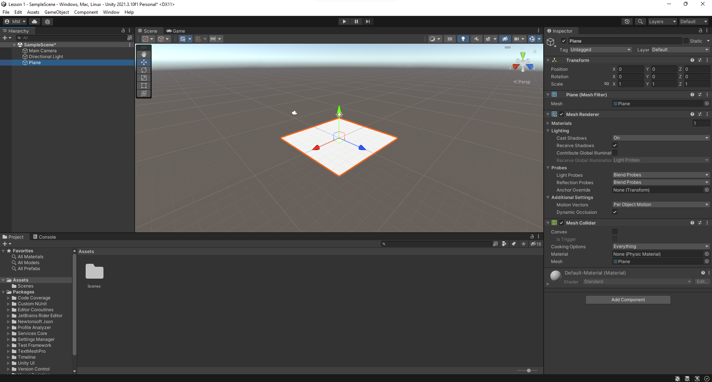
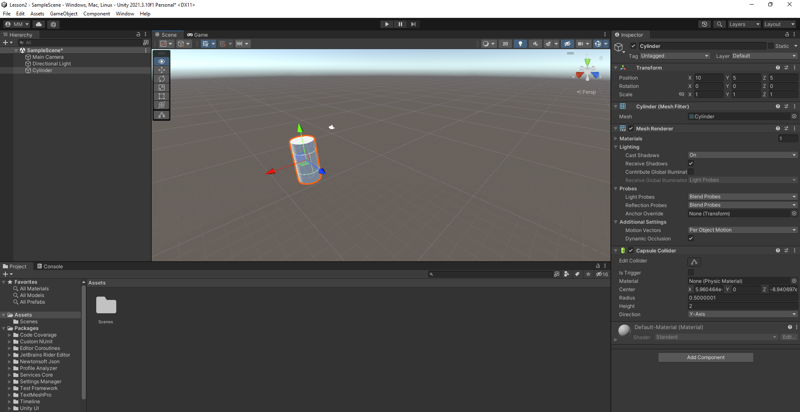

# РАЗРАБОТКА ИГРОВЫХ СЕРВИСОВ
Отчет по лабораторной работе #1 выполнил(а):
- Мишуров Максим Игоревич
- РИ000024
Отметка о выполнении заданий (заполняется студентом):

| Задание | Выполнение | Баллы |
| ------ | ------ | ------ |
| Задание 1 | * | 60 |
| Задание 2 | * | 20 |
| Задание 3 | * | 20 |

знак "*" - задание выполнено; знак "#" - задание не выполнено;

Работу проверили:
- к.т.н., доцент Денисов Д.В.
- к.э.н., доцент Панов М.А.
- ст. преп., Фадеев В.О.

[](https://nodesource.com/products/nsolid)

[](https://travis-ci.org/joemccann/dillinger)

Структура отчета

- Данные о работе: название работы, фио, группа, выполненные задания.
- Цель работы.
- Задание 1.
- Код реализации выполнения задания. Визуализация результатов выполнения (если применимо).
- Задание 2.
- Код реализации выполнения задания. Визуализация результатов выполнения (если применимо).
- Задание 3.
- Код реализации выполнения задания. Визуализация результатов выполнения (если применимо).
- Выводы.
- ✨Magic ✨

## Цель работы
Ознакомиться с основными функциями Unity и взаимодействием с объектами внутри редактора.

## Задание 1
### В разделе «ход работы» пошагово выполнить каждый пункт с описанием и примера реализации задач по теме видео «Практическая работа 1-4».
Ход работы:

1) Создать новый проект из шаблона 3D – Core;


2) Проверить, что настроена интеграция редактора Unity и Visual Studio Code (пункты 8-10 введения);


3) Создать объект `Plane`;



4) Создать объект `Cube`;


5) Создать объект `Sphere`;


6) Установить компонент `Sphere Collider` для объекта `Sphere`;
7) Настроить `Sphere Collider` в роли триггера;


8) Объект куб перекрасить в красный цвет;


9) Добавить кубу симуляцию физики, при это куб не должен проваливаться под `Plane`;


10) Написать скрипт, который будет выводить в консоль сообщение о том, что объект Sphere столкнулся с объектом `Cube`;


11) При столкновении `Cube` должен менять свой цвет на зелёный, а при завершении столкновения обратно на красный.


## Задание 2
### Продемонстрируйте на сцене в Unity следующее:  
- Что произойдёт с координатами объекта, если он перестанет быть дочерним?  
- Создайте три различных примера работы компонента `RigidBody`.

Ход работы:  

1.1. Я создал новый объект `Cylinder` и задал ему координаты `(10, 5, 5)`.  



1.2. Затем создал дочерний объект `Capsule`, который появился в объекте `Cylinder`.  


1.3. Изменил координаты `Capsule` на `(1, 1, 1)`, объект сместился относительно `Cylinder` на эти значения.  


1.4. Предположил, что отображение `Capsule` складывается из координат родителя `Cylinder` + свои координаты `(10+1, 5+1, 5+1)`.  
После удаления связи с родителем, проверил координаты `(11, 6, 6)` и мое предположение оказалось верным.  


  
2. Я создал 3 объекта: `Plane`, `Cube`, и `Sphere`  


Сценарий 1:  
`Plane` со свойствами `Use Gravity`: off и `Is Kinematic`: on;  
`Cube` со свойствами: `Use Gravity`: off и `Is Kinematic`: on;  
`Sphere` со свойствами: `Use Gravity`: on и `Is Kinematic`: on;  
Сфера будет висеть в воздухе и никуда не двинется, равно как и куб.  
Пластина никак не реагирует на изменение параметра `Use Gravity`.  


Сценарий 2:  
`Plane` со свойствами `Use Gravity`: off и `Is Kinematic`: on;  
`Cube` со свойствами: `Use Gravity`: off и `Is Kinematic`: on;  
`Sphere` со свойствами: `Use Gravity`: on и `Is Kinematic`: off;  
Сфера упадет на куб, куб не двинется.  


Сценарий 3:  
`Plane` со свойствами `Use Gravity`: off и `Is Kinematic`: on;  
`Cube` со свойствами: `Use Gravity`: off и `Is Kinematic`: off;  
`Sphere` со свойствами: `Use Gravity`: on и `Is Kinematic`: off;  
Сфера упадет на куб, куб от столкновения со сферой придет в движение и столкнется с пластиной. 


Сценарий 4:  
`Plane` со свойствами `Use Gravity`: off и `Is Kinematic`: off;  
`Cube` со свойствами: `Use Gravity`: off и `Is Kinematic`: off;  
`Sphere` со свойствами: `Use Gravity`: on и `Is Kinematic`: off;  
Сфера упадет на куб, куб от столкновения со сферой придет в движение и они вместе провалятся сквозь пластину в бесконечность. 


## Задание 3
### Реализуйте на сцене генерацию n кубиков. Число n вводится пользователем после старта сцены.

Ход работы:

Для начала я создал новый проект и добавил 2 UI элемента: `TMP_InputField` и `Button`.  


Затем я создал скрипт `Generator.cs` и назначил его объекту `Canvas`, на котором расположены кнопка и поле для текста.


Приступил к написанию скрипта, для взаимодействия с полем текста и кнопкой добавил соответствующие `[SerializeField]`:
```c#
[SerializeField] private TMP_InputField inputText;
[SerializeField] private Button button;
```
А также добавил в `using` необходимые библиотеки:
```c#
using UnityEngine.UI;
using TMPro;
```
`[SerializeField]` позволяет взаимодействовать с переменными в редакторе сцены


Привязал созданные кнопку и поле к скрипту

Для генерации кубиков буду использовать `Object.Instantiate` по 3D вектору
```c#
//public static Object Instantiate(Object original, Vector3 position, Quaternion rotation);
```
Мне не хватает объекта `Cube`, на основе которого будут генерироваться остальные, создал 1 и поменял скейл на `(50, 50, 50)`, потому что размеры `Canvas` не менялиь, и разбираться с этим буду в другой раз, сегодня генерация кубиков.

```c#
[SerializeField] private GameObject cubePrefab;
```


А также я добавил объект `Canvas` в скрипт, чтобы заставить его исчезнуть по нажатию кнопки.

```c#
[SerializeField] private Canvas canvas;
```

Привязал куб и канвас к скрипту


Осталось написать алгоритм генерации рандомных координат 3D вектора
```c#
private int cubeCount;

if (inputText != null) cubeCount = int.Parse(inputText.text);
        for (int i = 0; i < cubeCount; i++)
        {
            var value = Random.insideUnitCircle * 1000;

            Vector3 pos = new Vector3(
                value.x,
                Random.Range(0,100),
                value.y);
        }
```
Запускаться алгоритм будет по нажатию кнопки, через "прослушку"
Осталось добавить в конце цикла генерацию объекта, а после цикла скрыть `Canvas`, и вот итоговый код:

```c#
using System.Collections;
using System.Collections.Generic;
using UnityEngine;
using UnityEngine.UI;
using TMPro;


public class Generator : MonoBehaviour
{
    [SerializeField] private TMP_InputField inputText;
    [SerializeField] private Button button;
    [SerializeField] private GameObject cubePrefab;
    [SerializeField] private Canvas canvas;
    private int cubeCount;

    // Start is called before the first frame update
    private void Start()
    {
        button.onClick.AddListener(TaskOnClick);
    }

    public void TaskOnClick()
    {
        if (inputText != null) cubeCount = int.Parse(inputText.text);
        for (int i = 0; i < cubeCount; i++)
        {
            var value = Random.insideUnitCircle * 1000;

            Vector3 pos = new Vector3(
                value.x,
                Random.Range(0,100),
                value.y);
            Instantiate(cubePrefab, pos, Quaternion.identity);
        }
        canvas.enabled = false;
    }
}
```
Жмем `play`


## Выводы

Мне удалось настроить окружение `Unity`, выполнить все задания. Я подружился с документацией `Unity`, в конорой нашел много интересных функций и методов. А ещё я научился заполнять `Readme` на `github`

| Plugin | README |
| ------ | ------ |
| Dropbox | [plugins/dropbox/README.md][PlDb] |
| GitHub | [plugins/github/README.md][PlGh] |
| Google Drive | [plugins/googledrive/README.md][PlGd] |
| OneDrive | [plugins/onedrive/README.md][PlOd] |
| Medium | [plugins/medium/README.md][PlMe] |
| Google Analytics | [plugins/googleanalytics/README.md][PlGa] |

## Powered by

**BigDigital Team: Denisov | Fadeev | Panov**
